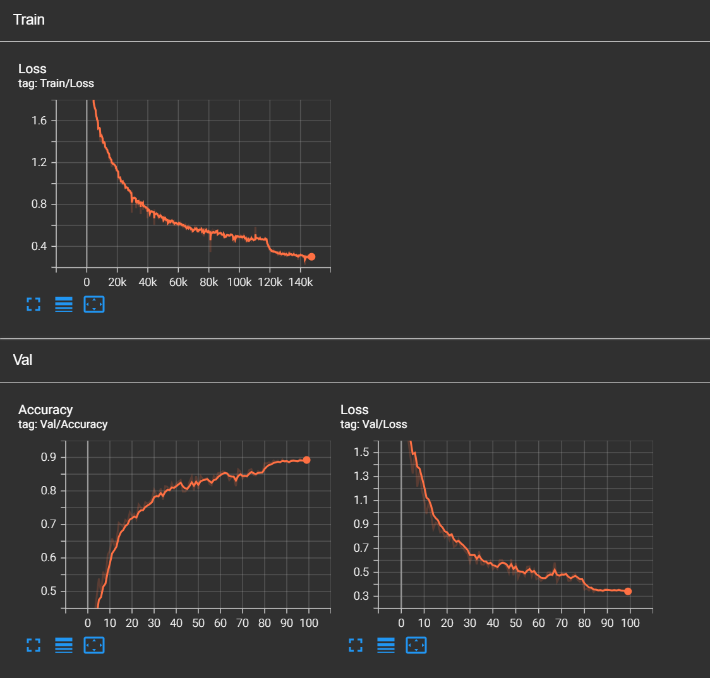

# Animal Image Classification with Custom CNN

A deep learning project that classifies animal images using a custom-built Convolutional Neural Network (CNN) implemented in **PyTorch**.  
The model was trained with advanced techniques such as **data augmentation**, **AdamW optimizer**, and **learning rate scheduling (ReduceLROnPlateau)** to achieve high accuracy while keeping the model from overfitting.

---

## Project Overview

This project demonstrates the full deep learning workflow — from dataset preparation to deployment:

1. **Data loading & preprocessing** by transform input images
2. **Model architecture** designed from scratch (5 convolutional blocks + Adaptive Average Pooling + Linear)
3. **Training loop** with real-time TensorBoard logging
4. **Validation & checkpointing** to save the best model
5. **Inference script** for single-image prediction

---

## Project Structure
```
Animal-CNN-Classifier
├── my_tensorboard/  # TensorBoard logs (loss & accuracy curves)
├── dataset.py       # Custom dataset loader for training & validation
├── model.py         # CNN architecture definition
├── train.py         # Training loop with checkpoint saving & tensorboard logging
├── inference.py     # Script for running inference on single image
├── curr_model.pt    # Latest model checkpoint
├── best_model.pt    # Best model weights (highest validation accuracy)
└── README.md        # Project description
```

---

## Datasets
| Dataset                | Classes |    #Train images      |    #Validation images      |
|------------------------|:---------:|:-----------------------:|:----------------------------:|
| Animals-10               |    10   |         23583        |             2596           |

- **Animals-10**:
  Download the dataset from [kaggle](https://www.kaggle.com/datasets/alessiocorrado99/animals10/data). Make sure to put the files and folders as the following structure (The root folder names **raw-image**):
  ```
  raw-image
  ├── test
  │   ├── butterfly
  │   ├── cat
  │   ├── chicken
  │   ├── cow
  │   ├── dog
  │   ├── elephant
  │   ├── horse
  │   ├── sheep
  │   ├── spider
  │   └── squirrel
  ├── train
  │   ├── butterfly
  │   ├── cat
  │   ├── chicken
  │   ├── cow
  │   ├── dog
  │   ├── elephant
  │   ├── horse
  │   ├── sheep
  │   ├── spider
  │   └── squirrel
  └── translate.py 
  ```

---

## Model Architecture
- 5 convolutional blocks (3 → 64 → 64 → 128 → 256 → 512 channels)
- Kernel size: 3×3  
- Stride: varies (1 or 2 for downsampling)
- BatchNorm + ReLU after each Conv
- Adaptive Average Pooling to (1×1)
- Fully connected layer: 512 → 10 (number of classes)
- **Total parameters: ~4.7M**

---

## Evaluation
Some statistics are shown below:
<p align="center">
  <br/>
  <i>Statistics of train and validation loss.</i>
</p>

<p align="center">
  <br/>
  <i>Confusion matrix distribution.</i>
</p>
